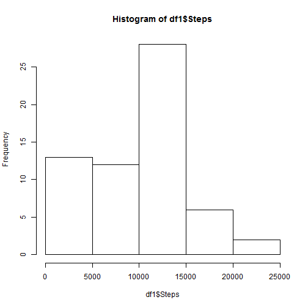
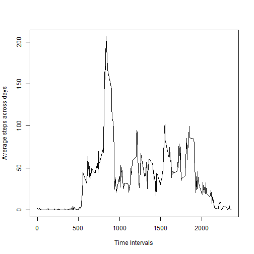
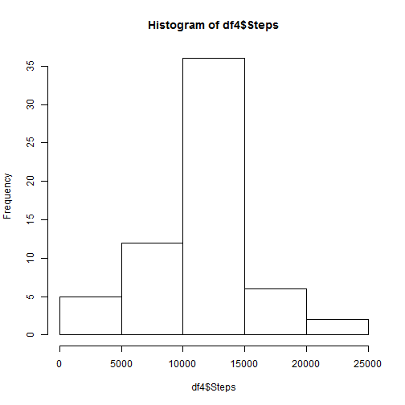
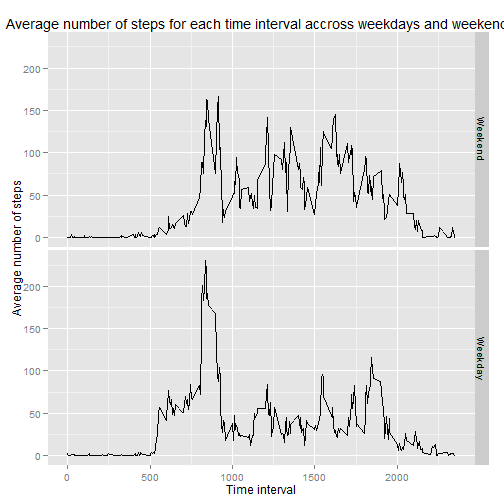

## Loading and preprocessing the data

1.Load the data

First verifies if the file containing the data exists in the working direcctory. Then downloads, unzips and reads the file. The data frame (df) is generated.

```r
if (!file.exists("activity.csv"))
{
        url<-"http://d396qusza40orc.cloudfront.net/repdata%2Fdata%2Factivity.zip"
        download.file(url,"repdata_Fdata_Factivity.zip", mode="wb")
        unzip("repdata_Fdata_Factivity.zip")
}

df<-read.csv("activity.csv")
```

2. Process/transform the data (if necessary) into a format suitable for your analysis

The next code chunk transforms the date column to an object of class date. The required libraries are loaded.


```r
df$date<-as.Date(df$date, format = "%Y-%m-%d")
library (timeDate)
library(ggplot2)
```

## What is mean total number of steps taken per day?
1. Make a histogram of the total number of steps taken each day


```r
df1<-aggregate(df$steps, by=list(df$date), FUN=sum, na.rm=TRUE)
names(df1)<-c("Date","Steps")
hist(df1$Steps)
```

 

2. Calculate and report the mean and median total number of steps taken per day


```r
mean(df1$Steps)
```

```
## [1] 9354.23
```

```r
median(df1$Steps)
```

```
## [1] 10395
```

## What is the average daily activity pattern?

1. Make a time series plot (i.e. type = "l") of the 5-minute interval (x-axis) and the average number of steps taken, averaged across all days (y-axis)


```r
df2<-aggregate(df$steps, by=list(df$interval), FUN=mean, na.rm=TRUE)
names(df2)<-c("Interval","AvgSteps")
with (df2, plot(Interval, AvgSteps, type="l", xlab="Time Intervals", ylab="Average steps across days"))
```

 

2. Which 5-minute interval, on average across all the days in the dataset, contains the maximum number of steps?

```r
df2$Interval[which.max(df2$AvgSteps)]
```

```
## [1] 835
```


## Imputing missing values

1. Calculate and report the total number of missing values in the dataset (i.e. the total number of rows with NAs)


```r
nacount<-is.na(df$steps)|is.na(df$date)|is.na(df$interval)
sum(nacount)
```

```
## [1] 2304
```

2. Devise a strategy for filling in all of the missing values in the dataset. 

The devised strategy was to use the the mean for each 5-minute interval. The dataset obtained previously is used as the source of these values.


3. Create a new dataset that is equal to the original dataset but with the missing data filled in.


```r
## Creates a new dataset which will have its NAs imputed.
df3<-df

for (i in 1:length(df3$steps))
{
        if (is.na(df3$steps[i]))
        {
                df3$steps[i]<-df2$AvgSteps[which(df2$Interval==df3$interval[i])]
        }
}
```


4. Make a histogram of the total number of steps taken each day and Calculate and report the mean and median total number of steps taken per day. 


```r
df4<-aggregate(df3$steps, by=list(df3$date), FUN=sum)
names(df4)<-c("Date","Steps")

hist(df4$Steps)
```

 

```r
mean(df4$Steps)
```

```
## [1] 10766.19
```

```r
median(df4$Steps)
```

```
## [1] 10766.19
```

Do these values differ from the estimates from the first part of the assignment? What is the impact of imputing missing data on the estimates of the total daily number of steps?

The mean and median values are different form those obtained before imputing. The impact of imputing the values may be seen on the histogram which now gets closer to a normal distribution. Also, the mean and the median are the same after imputing.


## Are there differences in activity patterns between weekdays and weekends?


1. Create a new factor variable in the dataset with two levels - "weekday" and "weekend" indicating whether a given date is a weekday or weekend day.


```r
for (i in 1:length(df3$steps))
{
        if (isWeekday(df3$date[i]))
        
                df3$week[i]<-TRUE
        else
                df3$week[i]<-FALSE
        
}

df3$week<-factor(df3$week, labels = c("Weekend", "Weekday"))
```


2. Make a panel plot containing a time series plot (i.e. type = "l") of the 5-minute interval (x-axis) and the average number of steps taken, averaged across all weekday days or weekend days (y-axis).


```r
df5<-aggregate(df3$steps, by=list(df3$interval, df3$week), FUN=mean)
names(df5)<-c("interval","week","steps")

ggplot(df5, aes(interval, steps))+
        geom_line()+
        facet_grid(week~.)+
        labs(title = "Average number of steps for each time interval accross weekdays and weekends")+
        labs(x = "Time interval")+
        labs(y = "Average number of steps")
```

 

There are differences in activity patterns between weekdays and weekends. On weekdays great part of the activity is concentradted in the morning until 10:00am. The maximum number of steps is only seen around 8:30am. In weekends the activity is more equally distributed throughout the day presenting a maximum number of steps around 150 which can be seen in other time intervals.
